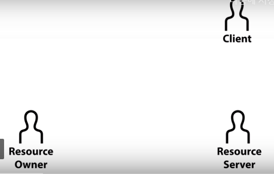

# Registration 

>> OAuth를 이용해 Resource Server에 접속하기 위해선 우선 Resource Server에 등록하는 과정 필요

>> 우리의 클라이언트가 리소스 서버를 이용하기 위해선
>> 리소스 서버에 승인을 사전에 받아 놔야 함 => 등록

>> 서비스마다 등록하는 방법이 다 다름
>> 등록하는 방법이 가장 공통적인 것은 
>> 클라이언트 ID와 클라이언트 secret, Authorized redirect URL 이 세가지 요소를 가짐

>> 클라이언트 ID : 우리가 만들고 있는 애플리케이션을 식별하는 ID
>> 클라이언트 secret : 비밀번호 (절대로 외부 노출되면 X)
>> Authorized redirect URL : 리소스 서버가 권한을 부여하는 과정에서 우리한테 Authorized code라는 값을 전달해 주는데, 그 때 이 주소로 전달해 주세요라고 알려줌
>> => 리소스 서버는 이 주소 말고 다른 데에서 오는 요청은 무시

>> developers.facebook.com => new app

