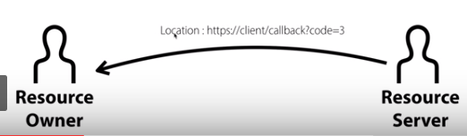
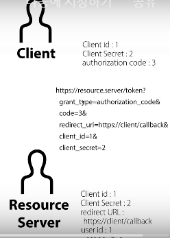

# Resource Server 

>> - 정리
>> Resource Server는 Client가 등록된 Client가 맞는지 확인하기 위해서 Resource Owner을 통해서 Client에게 Authorization code를 전달합니다. 
>> 이 값을 받은 Client는 이 값과 Client secret의 값을 Resource Server로 전송해서 Client의 신원을 Resource Owner에게 증명합니다.

>> 이전까지는 리소스 오너에 대한 허락을 획득했기 때문에, 리소스 서버의 승인 필요

>> 바로 액세스 토큰을 발급하지 않고 그 전 절차가 하나 더 있음
>> 3자간의 일이라 어려움
>> 그 때 사용하는 임시 PW : Authorization code

>> 이  Authorization code를 리소스 서버는 리소스 오너에게 전송 

>> 이런식으로 => 주소는 응답할 때 헤더라고 하는 값으로 Location이라고 하는 값을 주면 (리다이렉션)
>> 리다이렉션? 웹 브라우저한테 https 클라이언트 / 콜백?코드는 3이라는 주소로 이동하려고 명령함
>> => 리소스 서버가 리소스 오너의 웹 브라우저에게

>> ?code=3 : 아까 말했던 임시 비번 Authorization code 3 인 것

>> 리소스 오너의 웹 브라우저는 Location 헤더 값에 의해
>> 리소스 오너의 사용자 그 사람이 인식하지도 못하게 은밀하게 https://client/callback?code=3으로 이동을 하게 됨.
>> 그러면 저기 있는 코드 3번이라고 하는 값에 의해 
클라이언트는 authorization code 3이라는 값을 갖게 됨.
>> 이 때 클라이언트가 서버에게 authorization code 3이라는 정보를 전송해서 액세서 토큰을 발급하기 전 상태

>> => 클라이언트는 리소스 오너를 통하지 않고 리소스 서버에게 직접 접속함. 

>> grant_type ~~ 은 지금 코드를 통해 3자간 인증을 하고 있고 이걸 포함한 4가지 방법 존재
>> authorization code 값 전송, 리다이렉트 url 값도 이렇게 전송을 함 
>> 그리고 클라이언트 id 값과 클라이언트 secret 값을 
전송함

>> 즉, uthorization code, 클라이언트 secret 이 두가지 정보를 결합해 리소스 서버에게 전송하게 되는 것

>> 리소스 서버는 이제 authorization code 3번을 보고서 자기가 가지고 있는 authorization code 3번에 해당되는 정보와 일치하는 지 확인해야지
>> authorization code 3은 클라이언트 id 1한테 발급했던 것 
>> 그리고 그 클라이언트 id 1번의 secret은 2번이었어

>> 그러면 리소스 서버는 이 클라이언트가 전송한 코드 3과 클라이언트 id 1번과 클라이언트 secret 2번과 리다이렉트 url의 값이 완전히 일치하는지 확인하고 이 정보들이 모두 일치한다면 그 때 다음단계로 진행 

>> 다음 단계 : 액세스 토큰 발급

