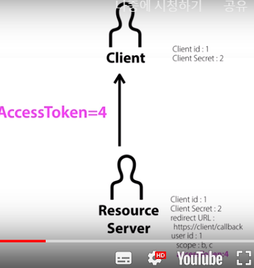

# Access Token

>> 정리 : 클라이언트가 리소스 오너를 통해 Authorization code 값을 받았다 
>> => 클라이언트는 리소스 서버에게 정보 전달
>> => 그 정보에서 클라이언트 secret 정보를 직접 리소스 서버에 authorization code와 함께 
>> 그 다음 access token을 발급 

# OAUTH의 목적 : ACCESS TOKEN 발급 

>> 그러면 리소스 서버는 authorization code를 통해서 인증을 했기 때문에 
>> 이제 authorization code 값을 지워버려야 함
>> 그래야지 다시 또 인증을 안 함

>> 리소스 서버는 액세스 토큰을 발급 
    => accessToken 발급 후 클라이언트에게 응답해줌 

>> 그럼 클라이언트는 액세스 토큰이 4라고 하는 것을 
내부적으로 데이터베이스나 파일에 저장을 하게  됨.
>> 그리고 이 액세스 토큰은 저 클라이언트가 4라고 하는 액세스 토큰으로 접근을 하게 되면 리소스 서버는 액세스 토큰 4를 보고  
>> '아 요 4는 user id 1번에 해당되는 사용자에 유효한 기능 b,c에 대해 권한이 열려있는 액세스 키니까'
b와 c => user id 1에 해당되는 사용자의 정보에 대해서
>> 액세스 토큰을 4를 가진 사람에게 허용을 해야 겠다라고 생각하고 동작하게 되는 것 

